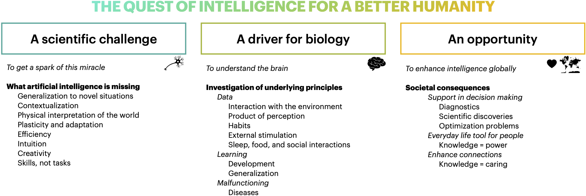

# Vanessa D'Amario

Bio 

## My vision

  

## Projects

## Publications
<a id="1">[1]</a> 
Vanessa D'Amario, Tomotake Sasaki, Xavier Boix (2021). 
**How Modular Should Neural Module Networks Be for Systematic Generalization?**
Proceedings in Advances in Neural Information Processing Systems 34.

<a id="1">[2]</a> 
Vanessa D'Amario, Sanjana Srivastava, Tomotake Sasaki, Xavier Boix (2021). 
**The Foes of Neural Network's Data Efficiency Among Unnecessary Input Dimensions**,
Under review.

<a id="1">[3]</a> 
Stephen Casper, Xavier Boix, Vanessa D'Amario, Lin Guo, Martin Schrimpf, Kasper Vinken, Gabriel Kreiman (2020). 
**Frivolous Units: Wider Networks Are Not Really That Wide**,
Proceedings of the AAAI Conference on Artificial Intelligence.

<a id="1">[4]</a> 
Thea Giacomini, Gianvittorio Luria, Vanessa D'Amario, Carolina Croci, Matteo Cataldi, Maria Piai, Giulia Nobile, Oliviero Bruni, Alessandro Consales, Maria Margherita Mancardi, Lino Nobili (2021). 
**On the role of REM sleep microstructure in suppressing interictal spikes in Electrical Status Epilepticus during Sleep**,
Under review.

<a id="1">[5]</a> 
Vanessa D'Amario (2020). 
**Machine Learning for Understanding Focal Epilepsy**, 
PhD Dissertation in Computer Science, Università degli Studi di Genova.

